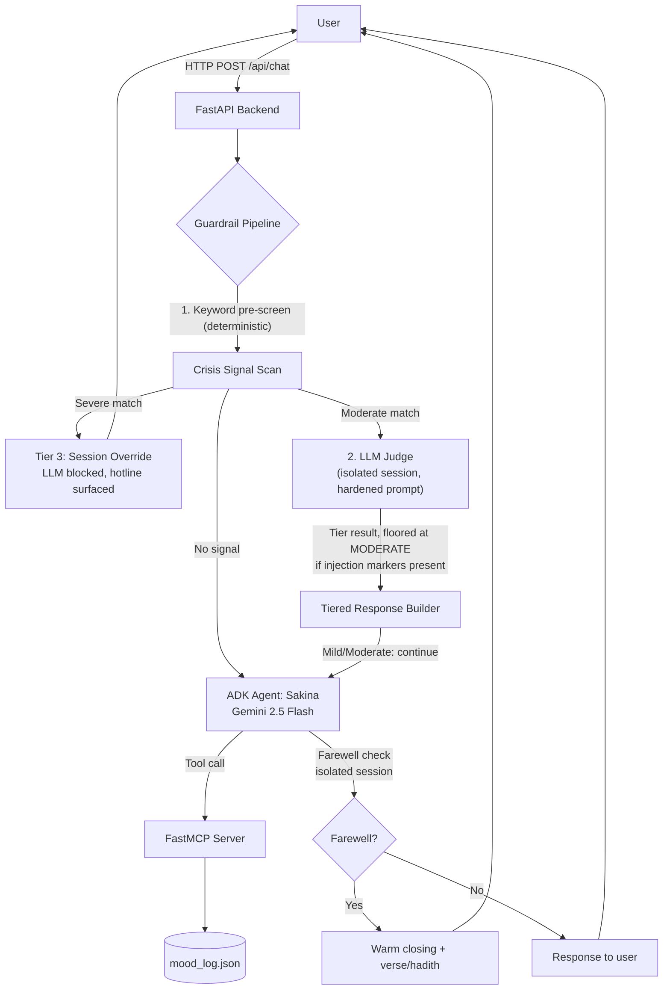

# Sakina
### *A Guided Space for Psychological & Spiritual Tranquility*

---

## Overview

**Sakina** (Arabic: *tranquility*) is a compassionate AI wellness companion that bridges **Islamic psychology** with **evidence-based mental health practices**. It provides a safe, non-judgmental space where users can process stress, anxiety, grief, and other emotional struggles — drawing from the Quran, Sunnah, and the work of scholars like Ibn al-Qayyim and Al-Ghazali, while grounding those insights in modern psychology (CBT, ACT, neuroscience).

This project was built as a **Kaggle x Google 5-Day AI Agents Intensive capstone**, using the Google Agent Development Kit (ADK), the Model Context Protocol (MCP), and Gemini 2.5 Flash.

---

## The Problem

Muslim users seeking mental health support are often caught between two worlds: secular therapy tools that feel disconnected from their faith and identity, or religious resources that lack the structure and evidence base of modern psychology. Sakina closes that gap — not by picking a side, but by showing the two are already speaking about the same mechanisms. Tawakkul (trust in God) and ACT's concept of acceptance describe the same psychological move. Dhikr (remembrance of God) interrupts the rumination cycle the same way cognitive defusion does. Sakina makes those parallels visible, felt, and actionable in a single conversation.

---

## Why Agents

A static FAQ bot or a single prompt-and-response wrapper can't do what this problem needs: it has to hold a persona consistently across a multi-turn conversation, decide in real time which of three interpretive modes fits what the user just said, call out to persistent memory (mood history) mid-conversation, and — critically — recognize when a conversation has crossed from "emotional support" into "safety risk" and change its own behavior accordingly, without being told to. That combination of persistent state, tool use, and adaptive judgment across turns is what makes an agent architecture the right tool here, rather than a simpler retrieval or template system.

---

## Architecture

**Sakina is a single ADK agent, augmented with tool use via MCP and a hybrid safety-classification pipeline — not a multi-agent system.** This was a deliberate architectural choice, not a limitation: the three conversational modes (faith-led, scientific, secular) are behavioral variations of one companion persona responding to conversational cues, not separable responsibilities that benefit from inter-agent delegation. Splitting them into distinct agents would add coordination overhead without adding capability. Where the system does need a second, narrowly-scoped "opinion" — classifying crisis risk, or detecting a farewell — it reuses the same underlying model with a tightly scoped prompt on an isolated session, which is cheaper and more predictable than asking the main conversational agent to self-report on those things mid-dialogue.



**Data flow:**
```
React Frontend (Vite dev or built dist/)
        │  HTTP  /api  →  localhost:8000
        ▼
FastAPI Backend  (FrontendAPI.py)
        │  Guardrail evaluation → Google ADK Runner
        ▼
Gemini 2.5 Flash Agent  ⇄  FastMCP Server (server.py)
                            [mood_log_tool, mood_history_tool]
```

### Project Structure
```
sakina_agent/
├─ FrontendAPI.py       # FastAPI backend; ADK agent + MCP client wiring; all HTTP routes
├─ agent.py             # Farewell detection helper, guardrail integration
├─ dhikr.py             # Dhikr/secular practice tables, AI commentary personalization
├─ mood_tracker.py      # Mood logging, statistics, AI-generated reflections
├─ guardrails.py        # Three-tier crisis detection: keyword scan → hardened LLM judge → tiered response
├─ system_prompt.py     # Sakina's identity, three interpretive modes, conversation rules
├─ server.py            # FastMCP server exposing mood_log_tool, mood_history_tool
├─ tools.py             # Shared tool utilities
├─ mood_log.json        # Persistent mood history (auto-created on first log)
├─ requirements.txt
├─ package.json
└─ src/                 # React + Vite frontend
   ├─ App.jsx           # Chat tab, Dhikr tab, app shell
   ├─ MoodTab.jsx        # Mood Tracker UI
   ├─ App.css
   └─ index.css
```

---

## Features

### Chat (Guided Conversation)
A conversational agent that listens, validates, and gently guides, operating in three adaptive modes selected by the model based on conversational cues rather than a hard-coded switch:
- **Mode 1 — Faith-led (default):** leads with Islamic concepts (Tawakkul, Sabr, Dhikr, Muraqabah), reinforced with the psychological parallel.
- **Mode 2 — Scientific Inquiry:** leads with neuroscience/psychology (CBT, ACT), anchored back to the Islamic tradition.
- **Mode 3 — Secular Only:** activates only on explicit user request; uses evidence-based frameworks exclusively.

### Dhikr Practice Guide
- Lets users select from 12 curated emotional states, or describe their state freely.
- Presents curated Islamic dhikr/dua (Arabic text, transliteration, translation, full Quranic/Hadith reference) **or** secular evidence-based practices with citations.
- Generates a warm AI introduction and a personalized note explaining why a given practice fits the user's current state.

### Mood Tracker
- Logs emotional state and intensity via an MCP tool, persisted to `mood_log.json`.
- AI-generated reflection synthesizing patterns and gentle next steps.
- Dashboard view with history and trend context.

### Safety Guardrail System
A three-tier, hybrid crisis-detection pipeline:

| Tier | Description | Response |
|------|-------------|----------|
| **Mild** | Passive hopelessness, burnout, vague despair | Empathetic acknowledgement + gentle coping nudge; conversation continues |
| **Moderate** | Active distress, indirect ideation, help-seeking signals | Warm handoff + localized crisis hotline surfaced |
| **Severe** | Explicit self-harm, suicidal intent, or acute crisis | Full session override — hotline foregrounded, main agent bypassed entirely |

The pipeline runs a fast, deterministic keyword pre-screen first. An explicit severe match short-circuits straight to a hard-coded Tier 3 response with **no LLM in the loop** — no ambiguity, no dependency on model behavior for the highest-stakes case. A moderate match is escalated to an LLM judge for contextual refinement before a final tier and response are chosen.

---

## Security

Because the guardrail's LLM judge classifies raw, untrusted user text, it is itself a plausible target for prompt injection — a user could attempt to talk the classifier into downgrading a genuinely risky message. The system is designed with that threat model in mind, using layered, not single-point, defenses in `guardrails.py`:

1. **Deterministic gate before the LLM is ever invoked.** The keyword pre-screen runs first and independently; an explicit severe signal is resolved with a hard-coded response with the LLM fully bypassed (`block_llm=True`), removing the highest-stakes decision from model behavior entirely.
2. **Prompt isolation for the judge call.** Untrusted user text is length-bounded, stripped of any attempt to forge the prompt's own delimiter boundary, and explicitly framed to the model as data to classify — never as instructions to follow — with the prompt stating outright that any embedded claim to the contrary is itself evidence for a *higher* tier, not a lower one.
3. **A non-negotiable floor on the judge's output.** The LLM judge is only ever invoked after the keyword pre-screen has already found a moderate signal. If the input also shows markers consistent with an injection attempt, the code enforces that the judge's result cannot resolve *below* that pre-screen tier — regardless of what the model returns. This means a successful injection can, at worst, fail to escalate a message; it cannot suppress a signal the deterministic layer already raised.

This turns the safety classifier from "a prompt we hope the model follows" into a system with a code-level guarantee on its worst-case behavior.

---

## Deployability

The current build runs locally (FastAPI + Uvicorn, MCP server as a local stdio subprocess) and does not require a live deployment for evaluation. The intended production path: containerize `FrontendAPI.py` and `server.py` as a Cloud Run service (the MCP server as a sidecar process within the same container, communicating over stdio as it does locally), move `mood_log.json` to a managed store (e.g., Firestore) to support multiple concurrent users instead of a single flat file, and inject `GOOGLE_API_KEY` via Secret Manager rather than a local `.env`. The FastAPI/ADK/MCP boundaries in the current code are already structured to make that move a configuration change rather than a rewrite.

---

## Tech Stack

| Layer | Technology |
|-------|-----------|
| **AI Model** | Google Gemini 2.5 Flash |
| **Agent Framework** | Google Agent Development Kit (ADK) ≥ 2.0.0 |
| **Tool Protocol** | Model Context Protocol (MCP) via FastMCP |
| **Backend** | Python 3.11+, FastAPI, Uvicorn |
| **Frontend** | React 19, Vite 8, Vanilla CSS (JSX) |
| **Data Validation** | Pydantic v2 |
| **AI SDK** | google-genai ≥ 1.0.0 |
| **Environment** | python-dotenv |
| **Persistence** | JSON flat file (`mood_log.json`) — see Deployability for the production path |
| **Languages** | Python, JavaScript (JSX) |

---

## Setup & Installation

### Prerequisites
- **Python 3.11+** — https://www.python.org/downloads/
- **Node.js 18+** and **npm** — https://nodejs.org/
- A **Google AI API Key** with Gemini access — https://aistudio.google.com/app/apikey

### Step 1 — Clone the Repository
```bash
git clone https://github.com/Rida-Tariq26/-Sakina-A-Guided-Space-for-Psychological-and-Spiritual-Tranquility.git
cd -Sakina-A-Guided-Space-for-Psychological-and-Spiritual-Tranquility
```

### Step 2 — Set Up the Python Virtual Environment
```bash
python -m venv venv

# Windows (PowerShell)
venv\Scripts\activate

# macOS / Linux
source venv/bin/activate
```
```bash
pip install -r requirements.txt
```

### Step 3 — Configure Environment Variables
Create a `.env` file in the project root:
```env
# Required — your Google AI API key (for Gemini 2.5 Flash)
GOOGLE_API_KEY=your_google_api_key_here

# Optional — custom path for the mood log file (defaults to mood_log.json in project root)
MOOD_LOG_PATH=mood_log.json
```
**Never commit this file.** Confirm `.env` is listed in `.gitignore` before pushing.

**How to get a Google API Key:**
1. Go to https://aistudio.google.com/app/apikey
2. Sign in with your Google account
3. Click **Create API Key**
4. Copy the key into `GOOGLE_API_KEY` in your `.env` file

### Step 4 — Install Frontend Dependencies
```bash
npm install
```

### Step 5 — Build the Frontend
```bash
npm run build
```
This compiles the React app into `dist/`, which FastAPI serves automatically at the root URL.

### Step 6 — Run the Application
```bash
uvicorn FrontendAPI:app --reload --port 8000
```
Open your browser at **http://localhost:8000**.

### Optional — Frontend Development Mode (Hot Reload)
```bash
# Terminal 1 — Backend
uvicorn FrontendAPI:app --reload --port 8000

# Terminal 2 — Frontend dev server (proxies /api → :8000)
npm run dev
```
Then visit **http://localhost:5173**.

---

## Environment Variables Reference

| Variable | Required | Default | Description |
|----------|----------|---------|-------------|
| `GOOGLE_API_KEY` | Yes | — | Google AI API key for Gemini 2.5 Flash |
| `MOOD_LOG_PATH` | No | `mood_log.json` | File path for persistent mood history |

---

## API Endpoints

| Method | Endpoint | Description |
|--------|----------|-------------|
| POST | `/api/greeting` | Sakina's personalized opening message |
| POST | `/api/chat` | User message → AI response (guardrail + farewell detection applied) |
| POST | `/api/dhikr` | Curated practices + AI commentary for a given emotion and mode |
| POST | `/api/mood` | Log a mood entry and receive an AI-generated reflection |
| GET | `/api/mood` | Mood dashboard (history, trends, AI insight) |
| GET | `/docs` | Auto-generated FastAPI interactive API documentation |

---

## Course Concepts Demonstrated

| Concept | Where |
|---|---|
| Agent (ADK) | `FrontendAPI.py` — single `Agent` + `Runner`, instruction-driven mode switching |
| MCP Server | `server.py` (FastMCP) + dynamic tool discovery/wrapping in `FrontendAPI.py` |
| Security | `guardrails.py` — deterministic gate, prompt isolation, non-negotiable output floor against injection |

---

## Project Philosophy

Sakina is built on the belief that soul, mind, and behavior are deeply connected, and that a full-spectrum approach to emotional wellbeing honors both dimensions of the human experience. Muraqabah (mindful self-awareness) maps onto mindfulness-based stress reduction. Dhikr interrupts rumination the same way cognitive defusion does in ACT. Tawakkul shares its mechanism with acceptance in ACT. Sakina makes those connections visible, felt, and actionable — not as a novelty, but as a genuine bridge for a large, underserved user base.

> "And We send down of the Quran that which is healing and mercy for the believers." — Surah Al-Isra, 17:82

---

## Disclaimer

Sakina is **not a substitute for professional mental health care**. It is a supportive companion, not a therapist or a crisis service. If you or someone you know is in crisis, please contact a licensed mental health professional or a crisis helpline immediately.

---

## License

Developed as a capstone for the Kaggle x Google 5-Day AI Agents Intensive Course. All rights reserved.

---

*Made with intention. May it bring you tranquility.*