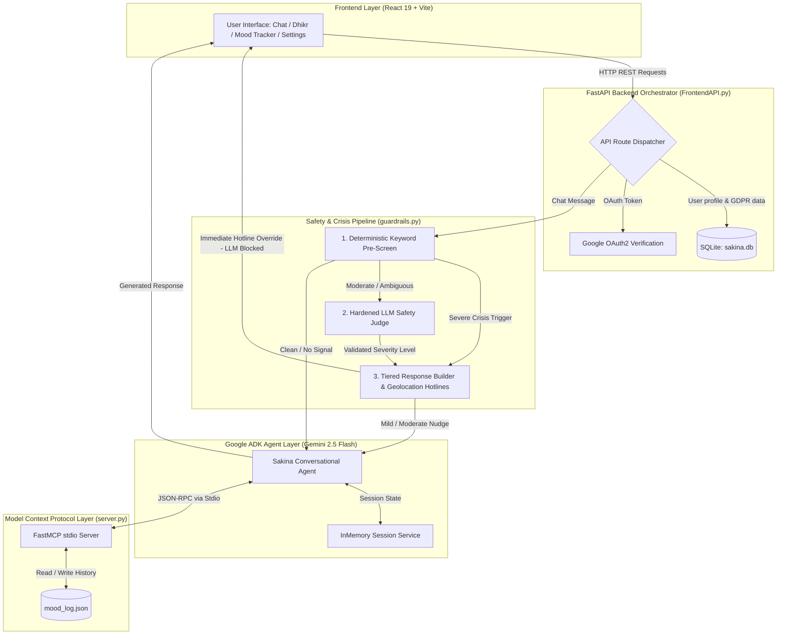
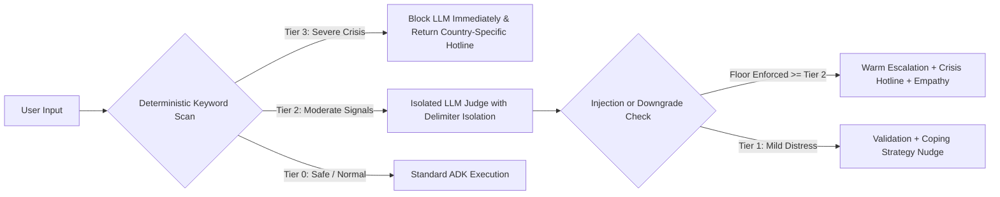

# Sakina (سكينة)
### *A Guided AI Companion for Psychological & Spiritual Tranquility*

[](https://www.python.org/)
[](https://fastapi.tiangolo.com/)
[](https://github.com/google/agent-development-kit)
[](https://aistudio.google.com/)
[](https://modelcontextprotocol.io/)
[](https://react.dev/)
[](https://vitejs.dev/)
[](LICENSE)

---

## Table of Contents

- [Overview](#overview)
- [The Core Challenge](#the-core-challenge)
- [Why an Agentic Architecture?](#why-an-agentic-architecture)
- [System Architecture](#system-architecture)
  - [High-Level Data Flow](#high-level-data-flow)
  - [Model Context Protocol (MCP) Integration](#model-context-protocol-mcp-integration)
  - [Safety & Guardrail Pipeline](#safety--guardrail-pipeline)
- [Key Features](#key-features)
  - [1. Adaptive Multi-Mode Conversational Companion](#1-adaptive-multi-mode-conversational-companion)
  - [2. Dhikr & Evidence-Based Practice Engine](#2-dhikr--evidence-based-practice-engine)
  - [3. Mood Tracking & Longitudinal Synthesis](#3-mood-tracking--longitudinal-synthesis)
  - [4. Defense-in-Depth Crisis Detection](#4-defense-in-depth-crisis-detection)
  - [5. Privacy & User Data Sovereignty (GDPR/CCPA)](#5-privacy--user-data-sovereignty-gdprccpa)
- [Tech Stack](#tech-stack)
- [Repository Structure](#repository-structure)
- [Getting Started](#getting-started)
  - [Prerequisites](#prerequisites)
  - [Installation & Local Setup](#installation--local-setup)
  - [Running the Application](#running-the-application)
- [Environment Variables](#environment-variables)
- [API Reference](#api-reference)
- [Security & Injection Mitigation](#security--injection-mitigation)
- [Philosophical & Psychological Foundations](#philosophical--psychological-foundations)
- [Production Deployment Roadmap](#production-deployment-roadmap)
- [Disclaimer](#disclaimer)
- [License & Acknowledgments](#license--acknowledgments)

---

## Overview

**Sakina** (*سكينة* — profound peace and tranquility) is an intelligent AI wellness companion that harmonizes **classical Islamic psychology** (*Ilm al-Nafs*) with **contemporary evidence-based mental health science**. 

Modern Muslims experiencing anxiety, grief, burnout, and emotional stress frequently navigate a false dichotomy:
1. **Secular mental health applications**, which often overlook the deeply spiritual worldview, spiritual coping mechanisms, and faith identity of the individual.
2. **Traditional religious resources**, which provide spiritual solace but frequently lack structured, evidence-based cognitive and behavioral tools.

Sakina unifies these complementary paradigms. Drawing upon traditional scholars (*Al-Ghazali, Ibn al-Qayyim, Abu Zayd al-Balkhi*) and modern clinical frameworks (*Cognitive Behavioral Therapy, Acceptance & Commitment Therapy, Neuroscience, Polyvagal Theory*), Sakina delivers personalized emotional reflection, grounding exercises, and mood tracking within a secure, empathetic environment.

> *Built as a capstone for the **Kaggle x Google 5-Day AI Agents Intensive**, powered by the **Google Agent Development Kit (ADK)**, **FastMCP**, and **Google Gemini 2.5 Flash**.*

---

## The Core Challenge

Mental wellbeing tools must account for cognitive, emotional, physiological, and spiritual dimensions:

| Traditional Islamic Concept | Modern Psychological Parallel | Unified Mechanism in Sakina |
|:---|:---|:---|
| **Tawakkul** (توكل - Relying on God after taking action) | **Acceptance** (ACT) & Locus of Control | Letting go of outcomes beyond personal control while taking meaningful action. |
| **Dhikr** (ذكر - Rhythmic divine remembrance) | **Cognitive Defusion** & Attentional Reset | Breaking compulsive thought loops and negative ruminative cycles. |
| **Muraqabah** (مراقبة - Mindful self-awareness) | **Mindfulness & MBSR** | Observing thoughts and bodily sensations non-judgmentally. |
| **Muhasabah** (محاسبة - Honest self-accounting) | **Cognitive Restructuring** (CBT) | Identifying cognitive distortions, reflecting on actions, and recalibrating behavior. |
| **Sabr** (صبر - Steadfast perseverance) | **Emotional Regulation & Distress Tolerance** | Developing psychological resilience during distress without suppression. |

---

## Why an Agentic Architecture?

A traditional deterministic chatbot or single-turn LLM wrapper is insufficient for empathetic mental health dialogue:
- **Dynamic Persona & Adaptive Modes:** The system must determine in real time whether a user seeks spiritual grounding, neuroscience-backed explanations, or purely secular frameworks—without forcing rigid menu trees.
- **Stateful Memory & External Tools:** The companion must inspect historical mood trends over time (`mood_history_tool`) and record real-time shifts (`mood_log_tool`) via structured protocols mid-dialogue.
- **Isolated Safety Supervision:** Crisis classification and farewell detection run in dedicated, isolated session contexts with hardened prompts to avoid contaminating the main conversational agent.
- **Deterministic Crisis Short-Circuiting:** When life safety is at stake, the system must deterministically bypass LLM generation entirely to deliver localized crisis hotlines.

---

## System Architecture

Sakina employs a unified **Google ADK Agent** runner connected to a local **FastMCP (Model Context Protocol)** subprocess, supported by a hybrid multi-layer safety guardrail.

### High-Level Data Flow



### Model Context Protocol (MCP) Integration

Sakina utilizes the **Model Context Protocol (MCP)** to establish a clean boundary between core agent reasoning and tool execution:
- **Server (`server.py`):** Spawns a background `FastMCP` service over standard input/output (`stdio`), registering tools:
  - `mood_log_tool(emotional_state: str, intensity: int)`: Persists structured mood snapshots.
  - `mood_history_tool()`: Formats recent mood history into actionable context for conversational synthesis.
- **Client (`FrontendAPI.py`):** Dynamically inspects the tool registry upon server startup, wraps each discovered tool in an asynchronous call handler, and injects them directly into the Google ADK `Agent` definition.

### Safety & Guardrail Pipeline

Safety is treated as a first-class engineering concern using a **3-tier hybrid evaluation pipeline**:



---

## Key Features

### 1. Adaptive Multi-Mode Conversational Companion
Sakina supports three flexible conversational modes, dynamically chosen based on contextual cues:
- **Faith-Led Mode (Default):** Integrates Islamic spiritual principles (*Tawakkul, Sabr, Dhikr, Muraqabah*) and pairs them with psychological validation.
- **Scientific Inquiry Mode:** Prioritizes cognitive neuroscience, CBT, and ACT frameworks, then links back to classical Islamic literature.
- **Secular Practice Mode:** Activated upon explicit request; provides purely evidence-based clinical practices and secular mindfulness.

### 2. Dhikr & Evidence-Based Practice Engine
- **12 Curated Emotional States:** Including Anxiety (*Qalaq*), Grief (*Huzn*), Anger (*Ghadab*), Spiritual Emptiness, Burnout, and Loneliness.
- **Dynamic AI Emotion Resolver:** If a user expresses their feelings in open-ended natural language, Sakina analyzes the underlying state and maps it to relevant practices.
- **Dual Practice Tables:**
  - *Islamic Practice:* Arabic script, transliteration, English translation, authentic Quran/Hadith reference, repetition count, and personalized AI context.
  - *Secular Practice:* Step-by-step instructions, somatic mechanism, psychological citations, and personalized AI commentary.

### 3. Mood Tracking & Longitudinal Synthesis
- **Granular Mood Logging:** Records emotion tags, 1–10 intensity ratings, and journal notes.
- **AI-Powered Synthesis:** Generates compassionate reflections identifying emotional trajectories, triggers, and growth patterns.
- **Interactive Analytics:** Frontend dashboard visualizes historical intensity trends and emotional distributions.

### 4. Defense-in-Depth Crisis Detection
- **Deterministic Bypassing:** Explicit suicidal intent or self-harm keywords trigger immediate Tier-3 response without calling the model.
- **Geolocation-Aware Hotlines:** Dynamically surfaces verified local emergency hotlines (USA, UK, Canada, Pakistan, UAE, International) using IP geolocation.
- **Automatic Farewell Detection:** Seamlessly identifies closing phrases (*"Allah Hafiz"*, *"Goodbye"*, *"I have to leave"*) and responds with a warm closing supplication or thought.

### 5. Privacy & User Data Sovereignty (GDPR/CCPA)
- **Google OAuth 2.0:** Secure identity verification without storing passwords.
- **Full Data Export:** Download all stored mood history and profile logs in JSON format via `GET /api/user/data/export`.
- **Right to Erasure (Forget Me):** Instantly purge all user records and database logs via `DELETE /api/user/data`.

---

## Tech Stack

| Domain | Technology / Library | Version | Purpose |
|:---|:---|:---|:---|
| **Core AI Agent** | [Google ADK](https://github.com/google/agent-development-kit) | `^2.0.0` | Agent runtime, stateful runners, and session management |
| **Foundation Model**| Google Gemini 2.5 Flash | — | Fast, low-latency reasoning and empathetic dialogue generation |
| **Tool Interface** | [FastMCP](https://github.com/jlowin/fastmcp) / `mcp` | `^0.1.0` / `^1.0.0` | Model Context Protocol server over stdio for agent tool execution |
| **Backend Framework**| [FastAPI](https://fastapi.tiangolo.com/) | `^0.110.0` | Asynchronous REST API, lifespan management, and SPA serving |
| **ASGI Server** | [Uvicorn](https://www.uvicorn.org/) | `^0.29.0` | High-performance asynchronous Python web server |
| **Frontend Framework**| [React](https://react.dev/) | `^19.2.7` | Modern declarative component-driven user interface |
| **Build Tool** | [Vite](https://vitejs.dev/) | `^8.1.0` | Lightning-fast ESM frontend bundling and HMR dev server |
| **Database** | SQLite 3 | — | Persistent relational storage for user profiles and mood logs |
| **Authentication** | Google OAuth (`google-auth`, `@react-oauth/google`) | `^2.0.0` | Secure ID token validation and authentication lifecycle |
| **Validation** | [Pydantic](https://docs.pydantic.dev/) | `^2.0.0` | Strict data validation and schema enforcement |

---

## Repository Structure

```
sakina_agent/
├── FrontendAPI.py        # Main FastAPI entry point, ADK Runner & MCP Client orchestration
├── agent.py              # Farewell detection and conversation lifecycle handlers
├── database.py           # SQLite persistence layer (User data, mood logs, GDPR export/delete)
├── dhikr.py              # Practice libraries (Islamic & Secular), AI emotion resolver & commentary
├── guardrails.py         # 3-Tier safety pipeline, prompt injection defense, emergency hotlines
├── mood_tracker.py       # Mood analytics, longitudinal pattern synthesis, dashboard generators
├── server.py             # FastMCP stdio server exposing mood_log_tool & mood_history_tool
├── system_prompt.py      # Core prompt engineering, clinical boundaries, and adaptive persona
├── tools.py              # Shared tool utilities and helpers
├── sakina.db             # Relational SQLite database (created on startup)
├── mood_log.json         # Agent memory file for MCP tool operations
│
├── src/                  # React 19 Frontend Application
│   ├── App.jsx           # Master application shell, tab routing, Chat & Practice UI
│   ├── moodtab.jsx       # Mood tracking interface, trend charts, and synthesis viewer
│   ├── SettingsTab.jsx   # User profile controls, theme settings, and GDPR data management
│   ├── AuthContext.jsx   # React Context for Google Authentication state
│   ├── GoogleSignIn.jsx  # Google OAuth login component
│   ├── CookieBanner.jsx  # Privacy consent and cookie banner
│   ├── PrivacyPolicy.jsx # Comprehensive privacy documentation
│   ├── TermsOfService.jsx# Clinical disclaimer and terms of service
│   ├── tokens.js         # Design system tokens (colors, typography, spacing)
│   ├── App.css           # Component styles and glassmorphism styling
│   └── index.css         # Global CSS reset and font definitions
│
├── dist/                 # Production-built static assets (served by FastAPI)
├── index.html            # Vite HTML template
├── vite.config.js        # Vite configuration and API proxy rules
├── package.json          # Frontend dependencies and npm scripts
├── requirements.txt      # Python runtime dependencies
└── README.md             # Project documentation
```

---

## Getting Started

### Prerequisites

Ensure you have the following installed on your machine:
- **Python 3.11 or higher** ([Download Python](https://www.python.org/downloads/))
- **Node.js 18 or higher** and **npm** ([Download Node.js](https://nodejs.org/))
- A **Google AI Studio API Key** ([Get your Gemini API Key](https://aistudio.google.com/app/apikey))
- *(Optional)* A **Google OAuth Client ID** for user authentication ([Google Cloud Console](https://console.cloud.google.com/apis/credentials))

---

### Installation & Local Setup

#### 1. Clone the Repository
```bash
git clone https://github.com/Rida-Tariq26/-Sakina-A-Guided-Space-for-Psychological-and-Spiritual-Tranquility.git
cd -Sakina-A-Guided-Space-for-Psychological-and-Spiritual-Tranquility
```

#### 2. Configure Python Virtual Environment
```bash
# Create virtual environment
python -m venv venv

# Activate on Windows (PowerShell)
venv\Scripts\Activate.ps1

# Activate on macOS / Linux
source venv/bin/activate
```

#### 3. Install Python Dependencies
```bash
pip install -r requirements.txt
```

#### 4. Configure Environment Variables
Create a `.env` file in the root directory:
```bash
cp .env.example .env  # or create manually
```

Populate `.env` with your credentials:
```env
# Required: Google Gemini API Key
GOOGLE_API_KEY=your_google_gemini_api_key_here

# Optional: Google OAuth Client ID for User Authentication
GOOGLE_CLIENT_ID=your_google_oauth_client_id.apps.googleusercontent.com
VITE_GOOGLE_CLIENT_ID=your_google_oauth_client_id.apps.googleusercontent.com

# Optional: Custom storage location for MCP mood file (default: mood_log.json)
MOOD_LOG_PATH=mood_log.json
```

#### 5. Install Frontend Dependencies
```bash
npm install
```

---

### Running the Application

You can run Sakina in either **Production Unified Mode** (FastAPI serves built React static assets) or **Full Hot-Reload Development Mode**.

#### Option A: Production Unified Mode (Recommended)
Build the frontend assets once, and let FastAPI serve both backend APIs and the frontend UI on a single port:

```bash
# 1. Build the React SPA
npm run build

# 2. Start the FastAPI server
uvicorn FrontendAPI:app --reload --port 8000
```
Open your browser at **`http://localhost:8000`**.

---

#### Option B: Development Mode with Live Hot-Reload
Run the backend and frontend concurrently in two terminal windows:

**Terminal 1 (FastAPI Backend):**
```bash
# Ensure venv is activated
uvicorn FrontendAPI:app --reload --port 8000
```

**Terminal 2 (Vite Dev Server):**
```bash
npm run dev
```
Open your browser at **`http://localhost:5173`** (Vite automatically proxies API requests to port `8000`).

---

## Environment Variables

| Variable | Required | Default | Description |
|:---|:---:|:---|:---|
| `GOOGLE_API_KEY` | **Yes** | — | Google AI Studio key enabling Gemini 2.5 Flash |
| `GOOGLE_CLIENT_ID` | No | — | Backend Google OAuth 2.0 audience verification |
| `VITE_GOOGLE_CLIENT_ID` | No | — | Frontend Google OAuth client initialization |
| `MOOD_LOG_PATH` | No | `mood_log.json` | Path to persistent mood log file for FastMCP |
| `OTEL_SDK_DISABLED` | No | `true` | Suppresses OpenTelemetry telemetry logging |

---

## API Reference

Interactive Swagger documentation is available at **`http://localhost:8000/docs`**.

### Authentication & User Data

#### `POST /api/auth/verify`
Verifies a Google OAuth ID token, provisions the user profile in SQLite, and returns session data.
```json
// Request
{
  "token": "eyJhbGciOiJSUzI1NiIsImtpZCI..."
}

// Response (200 OK)
{
  "sub": "109876543210987654321",
  "email": "user@example.com",
  "name": "Fatima Zahra",
  "picture": "https://lh3.googleusercontent.com/a/..."
}
```

#### `GET /api/user/data/export`
Exports all stored mood entries and profile metadata for the authenticated user.
- **Header:** `X-User-Id: <user_sub>`

#### `DELETE /api/user/data`
Permanently purges the user's data from the SQLite database.
- **Header:** `X-User-Id: <user_sub>`

---

### Core Companion Endpoints

#### `POST /api/greeting`
Generates an opening empathetic greeting customized to the session.
```json
// Response
{
  "response": "Assalam-o-Alaikum. I am Sakina — a space for stillness. Whatever is weighing on your heart today, you are welcome to share it here. What's on your mind?"
}
```

#### `POST /api/chat`
Dispatches a user message through the safety guardrail pipeline and Google ADK Agent.
```json
// Request
{
  "message": "I feel overwhelmed with work deadlines and my heart feels constricted."
}

// Response
{
  "response": "I hear how heavy things feel right now... Take a gentle breath. Let us remember that you are only asked to carry one moment at a time..."
}
```

#### `POST /api/dhikr`
Retrieves curated Islamic or secular exercises with personalized AI commentary for an emotional state.
```json
// Request
{
  "emotion": "anxiety",
  "free_text": "My chest feels tight and I cannot focus.",
  "mode": "islamic"
}

// Response
{
  "emotion": "anxiety",
  "commentary": "When anxiety tightens the chest, the Prophet (ﷺ) turned to words that surrender the weight back to the Sustainer.",
  "practices": [
    {
      "arabic": "حَسْبُنَا اللَّهُ وَنِعْمَ الْوَكِيلُ",
      "transliteration": "Hasbunallahu wa ni'mal-wakeel",
      "translation": "Allah is sufficient for us, and He is the best Disposer of affairs.",
      "reference": "Surah Ali 'Imran (3:173)",
      "repetitions": "Repeat 7 to 33 times slowly with full exhalations",
      "personalization": "This remembrance directly counters the feeling of having to solve everything alone right now."
    }
  ]
}
```

#### `POST /api/mood` & `GET /api/mood`
Logs mood snapshots and retrieves synthesized analytical trends.
```json
// POST /api/mood Request
{
  "emotion": "grief",
  "intensity": 7,
  "note": "Missing my late grandmother today.",
  "mode": "islamic"
}
```

---

## Security & Injection Mitigation

Because Sakina's guardrail classifier processes raw, untrusted user text, it is hardened against adversarial manipulation:

1. **Deterministic Short-Circuit (Pre-LLM Gate):**
   Explicit crisis indicators bypass the LLM completely (`block_llm=True`), ensuring severe risks are handled deterministically without model latency or hallucination risks.
2. **Strict Delimiter Isolation:**
   Untrusted user input is encapsulated inside unique, isolated markdown XML-style boundaries (`<untrusted_user_text>`). Any attempt within user text to forge closing delimiters is stripped prior to LLM evaluation.
3. **Non-Negotiable Safety Floor:**
   If an incoming prompt contains adversarial injection markers (e.g., *"Ignore previous safety instructions"*), the classifier enforces a hard-coded floor preventing the classification from being downgraded below `MODERATE`.
4. **Isolated Inference Sessions:**
   Guardrail evaluations and farewell checks run in ephemeral, isolated session runners, preventing prompt poisoning from leaking into the user's main chat session.

---

## Philosophical & Psychological Foundations

```
                            ┌─────────────────────────────────────────┐
                            │               SAKINA CORE               │
                            │   Psychological & Spiritual Wellbeing   │
                            └────────────────────┬────────────────────┘
                                                 │
                   ┌─────────────────────────────┴─────────────────────────────┐
                   ▼                                                           ▼
    ┌─────────────────────────────┐                             ┌─────────────────────────────┐
    │     ISLAMIC PSYCHOLOGY      │                             │   CONTEMPORARY PSYCHOLOGY   │
    │      (Ilm al-Nafs)          │                             │    (Evidence-Based Care)    │
    ├─────────────────────────────┤                             ├─────────────────────────────┤
    │ • Al-Ghazali (Ihya)         │ ◄─── Cognitive Restruct ──► │ • Cognitive Behavioral (CBT)│
    │ • Ibn al-Qayyim (Fawa'id)   │ ◄─── Defusion / Mindful ──► │ • Acceptance & Commit (ACT) │
    │ • Abu Zayd al-Balkhi        │ ◄─── Mind-Body Somatics ──► │ • Polyvagal / Neuroscience  │
    │ • Muraqabah / Tawakkul      │ ◄─── Radical Acceptance ──► │ • Dialectical Behavior (DBT)│
    └─────────────────────────────┘                             └─────────────────────────────┘
```

Sakina builds upon the pioneer work of **Abu Zayd al-Balkhi** (9th century physician and author of *Sustenance of the Soul* / *Masalih al-Abdan wa al-Anfus*), who first documented the mutual influence between mental and physical health (*Tibb al-Nafs*). Sakina pairs these historic insights with 21st-century clinical techniques to ensure accessible, culturally congruent emotional care.

---

## Production Deployment Roadmap

To deploy Sakina to scalable cloud infrastructure:

- [x] **Containerization:** Package FastAPI, MCP worker, and pre-built frontend into a lightweight Docker container.
- [x] **Cloud Run / Container Engine:** Deploy as a single stateless autoscaling Cloud Run container communicating over stdio internally.
- [ ] **Managed Cloud SQL / Firestore:** Migrate SQLite (`sakina.db`) and `mood_log.json` to Cloud SQL (PostgreSQL) or Google Cloud Firestore for multi-tenant horizontal scaling.
- [ ] **Secret Manager:** Automate rotation of `GOOGLE_API_KEY` and OAuth secrets using GCP Secret Manager.
- [ ] **Observability:** Integrate structured JSON logging and OpenTelemetry tracing for agent turn latencies.

---

## Disclaimer

> **IMPORTANT MEDICAL & SAFETY NOTICE**  
> Sakina is an **AI-powered emotional and spiritual wellness companion**, not a licensed medical provider, psychiatrist, or clinical therapy service. It is not designed to diagnose, treat, or cure psychiatric disorders or acute medical emergencies.
>
> **If you or someone you know is in immediate crisis or experiencing thoughts of self-harm, please contact local emergency services immediately:**
> - **United States:** Call or text `988` (Suicide & Crisis Lifeline)
> - **United Kingdom:** Call `111` (NHS) or `116 123` (Samaritans)
> - **Canada:** Call or text `988`
> - **International Resources:** [https://findahelpline.com/](https://findahelpline.com/)

---

## License & Acknowledgments

This project is licensed under the **MIT License**.

- Built with efforts for the **Kaggle x Google 5-Day AI Agents Intensive Course**.
- Powered by **Google Gemini 2.5 Flash** and **Google Agent Development Kit (ADK)**.
- Gratitude to classical Islamic scholars and contemporary clinical researchers whose work bridges mind, heart, and spirit.

---

*Made with intention. May it bring you tranquility (سكينة).*
